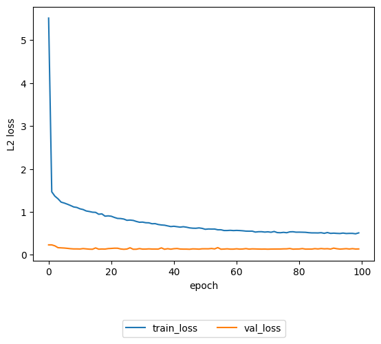
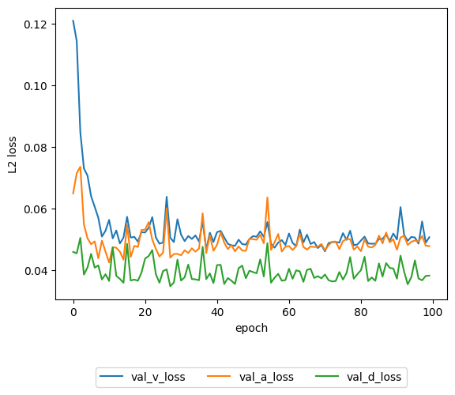

# Valence-Arousal-Dominance Regression using BERT
## Results
- Result for bert-base-uncase
  | V loss | A loss | D loss | Total | 
  |-|-|-|-|
  | | | | |
- L2 Loss over time
  
  

## Dataset
  - EmoBank
    - citation:
      Sven Buechel and Udo Hahn. 2017. Readers vs. writers vs. texts: Coping with different perspectives of text understanding in emotion annotation. In LAW 2017 - Proceedings of the 11th Linguistic Annotation Workshop @ EACL 2017. Valencia, Spain, April 3, 2017, pages 1-12. Available: https://sigann.github.io/LAW-XI-2017/papers/LAW01.pdf
